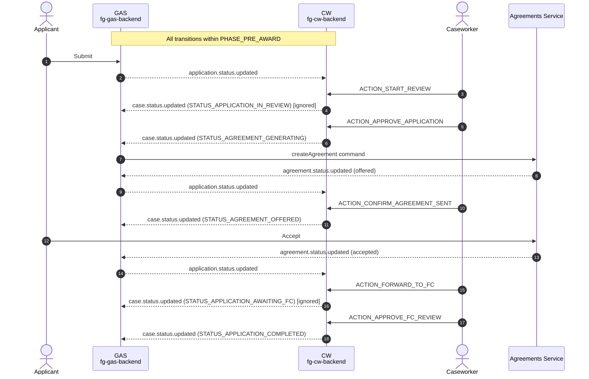

# State Flow: GAS ↔ CW ↔ Agreements Service (Agent Summary)

**Type**: Explanation (agent-oriented terse variant)  
**Reference**: Human-oriented version at `/Users/martins/workspace/ee/defra/fg-grants-core/docs/state-flow-gas-cw.md`

---

## Overview

Woodland applications flow through five GAS stages and six CW stages within `PHASE_PRE_AWARD`. The two state machines stay lock-step synchronized via event publication and `externalStatusMap` routing. GAS has two gates per transition: (1) `externalStatusMap` route lookup, (2) `validFrom` source validation.

---

## Sequence Diagram

Happy path: submit → caseworker approval → agreement generation → applicant accepts → FC review → complete.

---

## State Diagram

Two parallel state machines. GAS driven by events; CW driven by caseworker actions plus GAS events.

```mermaid
stateDiagram-v2
    direction LR
    classDef phase fill:#1f2937,stroke:#9ca3af,stroke-width:2px,color:#f9fafb
    classDef system fill:#0f172a,stroke:#64748b,stroke-width:2px,color:#f1f5f9

    state "GAS (5 stages)" as GAS {
        direction TB
        state PHASE_PRE_AWARD_GAS:::phase {
            [*] --> G_RECEIVED
            G_RECEIVED: STAGE_REVIEWING_APPLICATION<br/>STATUS_APPLICATION_RECEIVED
            G_GENERATING: STAGE_REVIEWING_APPLICATION<br/>STATUS_AGREEMENT_GENERATING<br/>fires GENERATE_OFFER
            G_READY: STAGE_PREPARING_AGREEMENT<br/>STATUS_AGREEMENT_READY_FOR_APPLICANT<br/>fires STORE_AGREEMENT_CASE
            G_OFFERED: STAGE_AGREEMENT_WITH_APPLICANT<br/>STATUS_AGREEMENT_OFFERED
            G_ACCEPTED: STAGE_AGREEMENT_ACCEPTED<br/>STATUS_AGREEMENT_ACCEPTED<br/>fires ACCEPT_AGREEMENT
            G_COMPLETE: STAGE_APPLICATION_COMPLETED<br/>STATUS_APPLICATION_COMPLETED

            G_RECEIVED --> G_GENERATING: CW STATUS_AGREEMENT_GENERATING
            G_GENERATING --> G_READY: AS offered
            G_READY --> G_OFFERED: CW STATUS_AGREEMENT_OFFERED
            G_OFFERED --> G_ACCEPTED: AS accepted
            G_ACCEPTED --> G_COMPLETE: CW STATUS_APPLICATION_COMPLETED
        }
        PHASE_PRE_AWARD_GAS: PHASE_PRE_AWARD
    }

    state "CW (6 stages)" as CW {
        direction TB
        state PHASE_PRE_AWARD_CW:::phase {
            [*] --> C_RECEIVED
            C_RECEIVED: STAGE_REVIEWING_APPLICATION<br/>STATUS_APPLICATION_RECEIVED
            C_IN_REVIEW: STAGE_REVIEWING_APPLICATION<br/>STATUS_APPLICATION_IN_REVIEW
            C_GENERATING: STAGE_REVIEWING_APPLICATION<br/>STATUS_AGREEMENT_GENERATING
            C_READY: STAGE_PREPARING_AGREEMENT<br/>STATUS_AGREEMENT_READY_FOR_APPLICANT
            C_OFFERED: STAGE_AGREEMENT_WITH_APPLICANT<br/>STATUS_AGREEMENT_OFFERED
            C_ACCEPTED: STAGE_AGREEMENT_ACCEPTED<br/>STATUS_AGREEMENT_ACCEPTED
            C_FC_AWAITING: STAGE_FC_REVIEWING<br/>STATUS_APPLICATION_AWAITING_FC
            C_COMPLETE: STAGE_APPLICATION_COMPLETED<br/>STATUS_APPLICATION_COMPLETED

            C_RECEIVED --> C_IN_REVIEW: ACTION_START_REVIEW
            C_IN_REVIEW --> C_GENERATING: ACTION_APPROVE_APPLICATION
            C_GENERATING --> C_READY: GAS event
            C_READY --> C_OFFERED: ACTION_CONFIRM_AGREEMENT_SENT
            C_OFFERED --> C_ACCEPTED: GAS event
            C_ACCEPTED --> C_FC_AWAITING: ACTION_FORWARD_TO_FC
            C_FC_AWAITING --> C_COMPLETE: ACTION_APPROVE_FC_REVIEW
        }
        PHASE_PRE_AWARD_CW: PHASE_PRE_AWARD
    }

    class GAS,CW system
```

---

## Transition Trigger Table

| Source | Transition | Trigger | Target | GAS `externalStatusMap` |
|---|---|---|---|---|
| Applicant | — | Submit | `REVIEWING_APPLICATION:RECEIVED` | entry point |
| Caseworker | CW | `ACTION_START_REVIEW` | `REVIEWING_APPLICATION:IN_REVIEW` | ignored |
| Caseworker | CW | `ACTION_APPROVE_APPLICATION` | `REVIEWING_APPLICATION:AGREEMENT_GENERATING` | routes |
| Agreements Service | AS | `offered` | `PREPARING_AGREEMENT:READY_FOR_APPLICANT` | routes |
| Caseworker | CW | `ACTION_CONFIRM_AGREEMENT_SENT` | `AGREEMENT_WITH_APPLICANT:OFFERED` | routes |
| Applicant | AS | Accept agreement | `AGREEMENT_WITH_APPLICANT:OFFERED` (AS) | — |
| Agreements Service | AS | `accepted` | `AGREEMENT_ACCEPTED:ACCEPTED` | routes |
| Caseworker | CW | `ACTION_FORWARD_TO_FC` | `FC_REVIEWING:AWAITING_FC` | ignored |
| Caseworker | CW | `ACTION_APPROVE_FC_REVIEW` | `APPLICATION_COMPLETED:COMPLETED` | routes |

---

## Key Rules

1. **`externalStatusMap` is stage-indexed**: Only routes under GAS's *current* stage are checked. Add routes to the stage where the event will be received, not the stage where you want to end up.

2. **Ignored transitions in CW don't break GAS**: If GAS ignores a CW event (no route), CW's state still advances locally, but GAS stays put. Example: `STATUS_APPLICATION_IN_REVIEW` (caseworker-internal only).

3. **GAS → CW must match exactly**: Every stage code GAS publishes must exist in CW's workflow definition, or CW's apply fails and dead-letters.

4. **Side-effect processes fire on `validFrom` acceptance**: Declared in the target status's `validFrom` rule. Example: `STATUS_AGREEMENT_GENERATING` fires `GENERATE_OFFER`, which asks Agreements Service to create the agreement.

---

## Source Files

- GAS workflow: `/Users/martins/workspace/ee/defra/fg-gas-backend/test/fixtures/wmp/woodland.json`
- CW workflow: `/Users/martins/workspace/ee/defra/fg-cw-backend/test/fixtures/woodland-workflow-definition.json`
- GAS routing: `/Users/martins/workspace/ee/defra/fg-gas-backend/src/grants/models/grant.js` (`mapExternalStateToInternalState`, `isValidTransition`)

**For deep understanding**: See human-oriented version (same directory).
