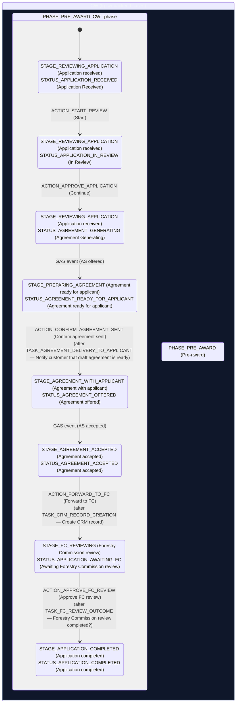

# CW State Diagram (with descriptive names)

**Source**: Extracted from [State Flow: GAS ↔ CW ↔ Agreements Service](./state-flow-gas-cw.md).
**Names from**: `fg-cw-backend/test/fixtures/woodland-workflow-definition.json` (workflow source of truth — the `*-case.json` file is a per-case instance and only carries the codes the case has reached).

Each phase, stage, status, action and task code is followed by its human-readable `name` in brackets.

