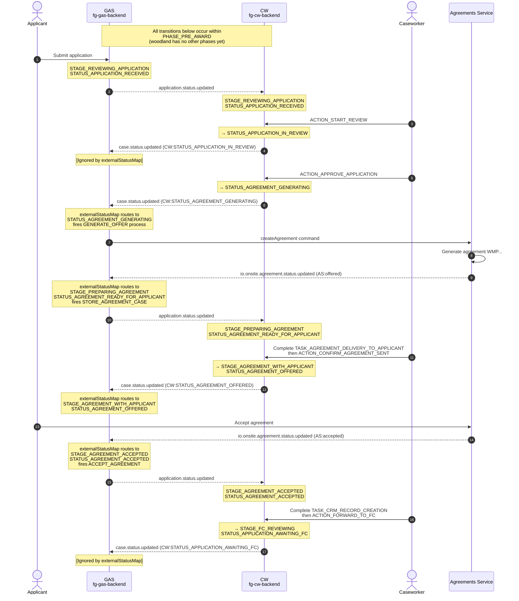

# State Flow: GAS ↔ CW ↔ Agreements Service

**Type**: Explanation (DIVIO/Diataxis)  
**Audience**: Engineers and caseworkers trying to understand how a woodland application moves through the system  
**Scope**: The happy-path lifecycle of a single application from submission to Forestry Commission handoff, across four services.

---

## Lead

This document explains *how* an application flows through the grant workflow system end-to-end. Think of it as a narrative walkthrough: here's what happens at each step, here's who triggers it, here's what the system does in response. It's the understanding-oriented companion to the more analytical [Cross-System Architecture](./cross-system-architecture.md) document (which explains *why* the architecture is the way it is) and the [Naming Conventions](./naming-conventions.md) guide (which covers terminology rules).

---

## Cast & Event Channels

Four systems collaborate. Each owns a distinct piece of the workflow:

| Participant | System | Role |
|---|---|---|
| **Applicant** | grants-ui | End user submitting and accepting the agreement |
| **Caseworker** | CW (fg-cw-backend) | Internal user driving the case forward |
| **GAS** | fg-gas-backend | Application authority; mirrors external state; fires downstream commands |
| **Agreements Service** | farming-grants-agreements-api | Generates and tracks the agreement document |

(See [Cross-System Architecture §2-3](./cross-system-architecture.md#system-boundaries) for deeper treatment of system ownership and event channels.)

---

## Sequence Diagram & Walkthrough

The happy path: application submitted → caseworker approval → agreement generation → applicant accepts → Forestry Commission review → complete.



### What Happens at Each Step

1. **Applicant submits** — Application lands in GAS in `STAGE_REVIEWING_APPLICATION:STATUS_APPLICATION_RECEIVED`. GAS publishes `application.status.updated`; CW receives it and mirrors the position.

2. **Caseworker clicks "Start review"** — CW transitions to `STATUS_APPLICATION_IN_REVIEW`. This is a caseworker-facing state only; GAS has no `externalStatusMap` route for it, so GAS ignores the event and stays in `STATUS_APPLICATION_RECEIVED`. (See [anti-mirror principle](./cross-system-architecture.md#anti-mirror).)

3. **Caseworker clicks "Approve"** — CW moves to `STATUS_AGREEMENT_GENERATING`. GAS routes this inbound event via `externalStatusMap` and stays in `STAGE_REVIEWING_APPLICATION:STATUS_AGREEMENT_GENERATING`. The `validFrom` rule on this status fires the `GENERATE_OFFER` process, which asks Agreements Service to create the WMP agreement.

4. **Agreements Service finishes generating** — AS emits `agreement.status.updated` with `status: "offered"`. GAS routes this via `externalStatusMap` → `STAGE_PREPARING_AGREEMENT:STATUS_AGREEMENT_READY_FOR_APPLICANT`. The `validFrom` rule fires `STORE_AGREEMENT_CASE`. GAS publishes its new position back to CW.

5. **Caseworker completes the delivery task and confirms sent** — CW has a mandatory task `TASK_AGREEMENT_DELIVERY_TO_APPLICANT` (remind the caseworker to email the applicant). After marking it complete, the caseworker clicks `ACTION_CONFIRM_AGREEMENT_SENT`, moving CW to `STAGE_AGREEMENT_WITH_APPLICANT:STATUS_AGREEMENT_OFFERED`. GAS routes this and follows.

6. **Applicant accepts in Agreements Service** — AS emits `agreement.status.updated` with `status: "accepted"`. GAS routes → `STAGE_AGREEMENT_ACCEPTED:STATUS_AGREEMENT_ACCEPTED` and fires `ACCEPT_AGREEMENT`. CW receives the GAS broadcast.

7. **Caseworker completes CRM task and forwards to FC** — CW has a mandatory task `TASK_CRM_RECORD_CREATION`. After completing it, caseworker clicks `ACTION_FORWARD_TO_FC`, moving CW to `STAGE_FC_REVIEWING:STATUS_APPLICATION_AWAITING_FC`. GAS ignores this (no route in `externalStatusMap`; it's caseworker-internal state).

8. **FC review completes** — Caseworker clicks `ACTION_APPROVE_FC_REVIEW` after completing `TASK_FC_REVIEW_OUTCOME`. CW moves to `STAGE_APPLICATION_COMPLETED:STATUS_APPLICATION_COMPLETED`. GAS routes this and reaches the same final state.

---

## State Diagram & Reading Guide

Two parallel state machines: GAS (5 stages) and CW (6 stages). Each transition is labelled with its trigger source.

```mermaid
stateDiagram-v2
    direction LR
    classDef phase fill:#1f2937,stroke:#9ca3af,stroke-width:2px,color:#f9fafb
    classDef system fill:#0f172a,stroke:#64748b,stroke-width:2px,color:#f1f5f9

    state "GAS (fg-gas-backend.applications)" as GAS {
        direction TB
        state PHASE_PRE_AWARD_GAS:::phase {
            [*] --> G_RECEIVED
            G_RECEIVED: STAGE_REVIEWING_APPLICATION<br/>STATUS_APPLICATION_RECEIVED
            G_GENERATING: STAGE_REVIEWING_APPLICATION<br/>STATUS_AGREEMENT_GENERATING<br/>(fires GENERATE_OFFER)
            G_READY: STAGE_PREPARING_AGREEMENT<br/>STATUS_AGREEMENT_READY_FOR_APPLICANT<br/>(fires STORE_AGREEMENT_CASE)
            G_OFFERED: STAGE_AGREEMENT_WITH_APPLICANT<br/>STATUS_AGREEMENT_OFFERED
            G_ACCEPTED: STAGE_AGREEMENT_ACCEPTED<br/>STATUS_AGREEMENT_ACCEPTED<br/>(fires ACCEPT_AGREEMENT)
            G_COMPLETE: STAGE_APPLICATION_COMPLETED<br/>STATUS_APPLICATION_COMPLETED

            G_RECEIVED --> G_GENERATING: (CW) STATUS_AGREEMENT_GENERATING
            G_GENERATING --> G_READY: (AS) offered
            G_READY --> G_OFFERED: (CW) STATUS_AGREEMENT_OFFERED
            G_OFFERED --> G_ACCEPTED: (AS) accepted
            G_ACCEPTED --> G_COMPLETE: (CW) STATUS_APPLICATION_COMPLETED
        }
        PHASE_PRE_AWARD_GAS: PHASE_PRE_AWARD
    }

    state "CW (fg-cw-backend.cases)" as CW {
        direction TB
        state PHASE_PRE_AWARD_CW:::phase {
            [*] --> C_RECEIVED
            C_RECEIVED: STAGE_REVIEWING_APPLICATION<br/>STATUS_APPLICATION_RECEIVED
            C_IN_REVIEW: STAGE_REVIEWING_APPLICATION<br/>STATUS_APPLICATION_IN_REVIEW
            C_GENERATING: STAGE_REVIEWING_APPLICATION<br/>STATUS_AGREEMENT_GENERATING
            C_READY: STAGE_PREPARING_AGREEMENT<br/>STATUS_AGREEMENT_READY_FOR_APPLICANT
            C_OFFERED: STAGE_AGREEMENT_WITH_APPLICANT<br/>STATUS_AGREEMENT_OFFERED
            C_ACCEPTED: STAGE_AGREEMENT_ACCEPTED<br/>STATUS_AGREEMENT_ACCEPTED
            C_FC_AWAITING: STAGE_FC_REVIEWING<br/>STATUS_APPLICATION_AWAITING_FC
            C_COMPLETE: STAGE_APPLICATION_COMPLETED<br/>STATUS_APPLICATION_COMPLETED

            C_RECEIVED --> C_IN_REVIEW: ACTION_START_REVIEW
            C_IN_REVIEW --> C_GENERATING: ACTION_APPROVE_APPLICATION
            C_GENERATING --> C_READY: GAS event (AS offered)
            C_READY --> C_OFFERED: ACTION_CONFIRM_AGREEMENT_SENT<br/>(after TASK_AGREEMENT_DELIVERY_TO_APPLICANT)
            C_OFFERED --> C_ACCEPTED: GAS event (AS accepted)
            C_ACCEPTED --> C_FC_AWAITING: ACTION_FORWARD_TO_FC<br/>(after TASK_CRM_RECORD_CREATION)
            C_FC_AWAITING --> C_COMPLETE: ACTION_APPROVE_FC_REVIEW<br/>(after TASK_FC_REVIEW_OUTCOME)
        }
        PHASE_PRE_AWARD_CW: PHASE_PRE_AWARD
    }

    class GAS,CW system
```



### Reading the Diagram

- **GAS (left, 5 states)**: Follows external events. No caseworker actions directly in GAS. Every transition is driven by inbound events from CW or Agreements Service, routed through `externalStatusMap`.

- **CW (right, 6 states)**: Caseworker-centric. Most transitions are action-driven (`ACTION_*`), with some event-driven moves coming back in from GAS.

- **Why CW has more states**: CW has `STATUS_APPLICATION_IN_REVIEW` and `STAGE_FC_REVIEWING:STATUS_APPLICATION_AWAITING_FC` that GAS doesn't track. Why? Because these are caseworker-internal workflow states — they don't represent business milestones that external consumers (applicants, data exports, downstream services) care about. This is the **anti-mirror principle**: GAS intentionally omits cosmetic states. See [Cross-System Architecture §5](./cross-system-architecture.md#anti-mirror) for why this matters and real incidents it caused.

- **Lock-step propagation**: Because GAS publishes every state change and CW subscribes, the two machines stay synchronized despite running independently. When CW transitions, it publishes; GAS receives and routes via `externalStatusMap`. When AS fires an event, GAS routes it and publishes back; CW receives and applies.

---

## Two Routing Gates in GAS

Every inbound event in GAS must pass two gates before the transition fires. Understanding both prevents the majority of stuck-application bugs.

### Gate 1: `externalStatusMap` Routing

After GAS receives an inbound event (source: CW or AS, code: the status/agreement code), it looks up the routing rule in `externalStatusMap`:

```
IF (GAS.currentStage == externalStatusMap.stage.code)
  AND (externalStatusMap.stage.status contains the inbound event code)
THEN route TO externalStatusMap.mappedTo
ELSE ignore event (or error if strict mode)
```

**Key insight**: Routes are **stage-indexed**. GAS only checks routes under its *current* stage. If GAS is in `STAGE_PREPARING_AGREEMENT` and receives a CW event, only the routes under `STAGE_PREPARING_AGREEMENT` in the map are consulted.

For woodland, the map is sparse intentionally:

| GAS current stage | Accepts from CW | Accepts from AS |
|---|---|---|
| `STAGE_REVIEWING_APPLICATION` | `STATUS_AGREEMENT_GENERATING` | `offered` |
| `STAGE_PREPARING_AGREEMENT` | `STATUS_AGREEMENT_OFFERED` | (none) |
| `STAGE_AGREEMENT_WITH_APPLICANT` | (none) | `accepted` |
| `STAGE_AGREEMENT_ACCEPTED` | `STATUS_APPLICATION_COMPLETED` | (none) |

Events not in this table are ignored. Example: CW emits `STATUS_APPLICATION_IN_REVIEW` while GAS is in `STAGE_REVIEWING_APPLICATION`. No matching route; GAS ignores it. Caseworkers see the update in their interface; applicants see no change (grants-ui only reads GAS status).

### Gate 2: `validFrom` Transition Validation

After routing succeeds, GAS checks the target status's `validFrom` rule:

```
validFrom = [
  { code: SOURCE_STATE, processes: [PROCESS1, PROCESS2, ...] },
  ...
]

IF targetStatus.validFrom contains { code: currentState }
THEN apply transition and fire processes
ELSE reject transition
```

This gate acts as a **state machine invariant**. It ensures you can't, say, jump from `STATUS_APPLICATION_RECEIVED` directly to `STATUS_APPLICATION_COMPLETED`. It also **declares side-effect processes** — fires that happen when you enter the target state.

For woodland's key transitions:

| Target | Allowed Source | Side-effect |
|---|---|---|
| `STATUS_AGREEMENT_GENERATING` | `STATUS_APPLICATION_RECEIVED` | `GENERATE_OFFER` (ask AS to create agreement) |
| `STATUS_AGREEMENT_READY_FOR_APPLICANT` | `STAGE_REVIEWING_APPLICATION:STATUS_AGREEMENT_GENERATING` | `STORE_AGREEMENT_CASE` (persist agreement reference) |
| `STATUS_AGREEMENT_OFFERED` | `STAGE_PREPARING_AGREEMENT:STATUS_AGREEMENT_READY_FOR_APPLICANT` | (none) |
| `STATUS_AGREEMENT_ACCEPTED` | `STAGE_AGREEMENT_WITH_APPLICANT:STATUS_AGREEMENT_OFFERED` | `ACCEPT_AGREEMENT` (trigger downstream)  |
| `STATUS_APPLICATION_COMPLETED` | `STAGE_AGREEMENT_ACCEPTED:STATUS_AGREEMENT_ACCEPTED` | (none) |

---

## Failure Modes & Recovery

Three real incidents show what happens when these gates malfunction.

### Incident 1: `wmp-nya-xnb` — GAS Stuck Behind CW

**What happened**: Application showed `STATUS_AGREEMENT_OFFERED` in CW but still at `STATUS_AGREEMENT_READY_FOR_APPLICANT` in GAS.

**Root cause**: Gate 1 failure. When CW transitioned to `STATUS_AGREEMENT_OFFERED`, it broadcast the event. GAS was at `STAGE_PREPARING_AGREEMENT` and tried to route the inbound event using `externalStatusMap`. But the map had no entry for `(STAGE_PREPARING_AGREEMENT, CW:STATUS_AGREEMENT_OFFERED)`. No route found; GAS stayed put.

**What it teaches**: `externalStatusMap` is indexed by stage. When you add a new CW transition that fires while GAS is in a particular stage, you *must* add the corresponding route under that stage in the map.

### Incident 2: `wmp-va7-s2b` — Dead-Lettered Agreement Event

**What happened**: GAS received `AS:accepted` event but could not process it. Inbox event retried 5 times, then dead-lettered (moved to dead-letter queue).

**Root cause**: Both gates failed. 
- Gate 1: `STAGE_AGREEMENT_WITH_APPLICANT` block in `externalStatusMap` had no route for `AS:accepted`. 
- Gate 2: Even if a route existed, the `validFrom` rule for the target status was misconfigured — it referenced a non-existent source state.

**What it teaches**: Check both gates. A routing failure upstream doesn't automatically get caught by validation downstream. Both must be correct.

### Incident 3: `wmp-8a9-8fa` — CW Failed to Apply GAS Position

**What happened**: GAS published `application.status.updated` with position `PHASE_PRE_AWARD:STAGE_AGREEMENT_ACCEPTED:STATUS_AGREEMENT_ACCEPTED`. CW inbox event dead-lettered immediately.

**Root cause**: CW's workflow definition didn't have `STAGE_AGREEMENT_ACCEPTED`. When CW tried to apply the incoming position, it looked up the stage code and got "not found". Apply failed; retry after retry; dead-lettered.

**What it teaches**: The asymmetric coupling (see [Cross-System Architecture §4](./cross-system-architecture.md#asymmetric-coupling)): **Every stage code that GAS can publish must exist in CW's workflow.** Even if CW doesn't use it (no tasks, no actions), it must be defined.

---

## Source Files

- **GAS workflow & routing**: `/Users/martins/workspace/ee/defra/fg-gas-backend/test/fixtures/wmp/woodland.json` (phases, stages, statuses, validFrom rules, externalStatusMap)
- **CW workflow**: `/Users/martins/workspace/ee/defra/fg-cw-backend/test/fixtures/woodland-workflow-definition.json` (phases, stages, statuses, transitions, tasks, actions)
- **GAS routing implementation**: `/Users/martins/workspace/ee/defra/fg-gas-backend/src/grants/models/grant.js` (`mapExternalStateToInternalState()`, `isValidTransition()`)
- **GAS event ingress**: `/Users/martins/workspace/ee/defra/fg-gas-backend/src/grants/services/apply-event-status-change.service.js`
- **GAS event egress**: `/Users/martins/workspace/ee/defra/fg-gas-backend/src/grants/events/application-status-updated.event.js`

**Related docs**:
- [Cross-System Architecture](./cross-system-architecture.md) — Why the architecture is the way it is; asymmetric coupling; anti-mirror principle.
- [Naming Conventions](./naming-conventions.md) — Rules for state and action code naming.
- [Slim GAS Workflow Proposal](./adr/slim-gas-workflow-proposal.md) — How woodland went from 8 states to 6 and why.
